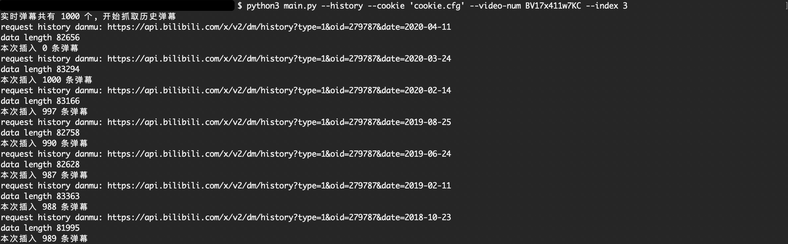
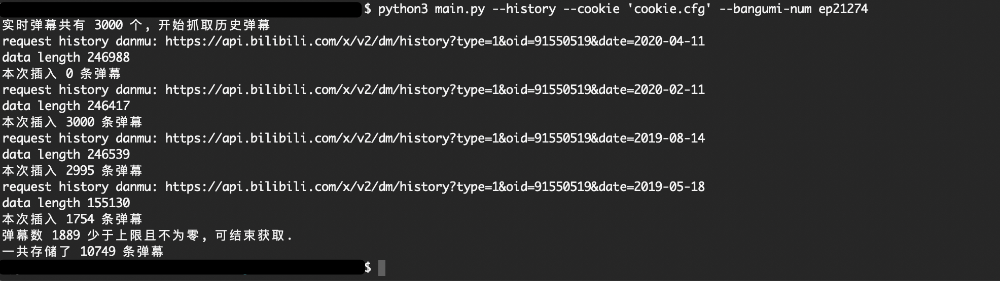
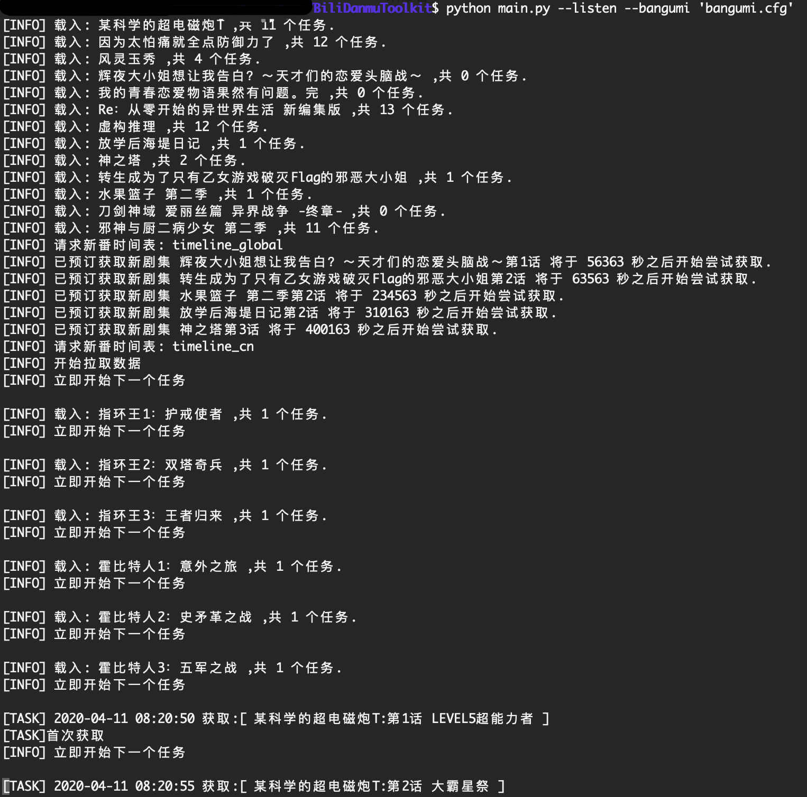
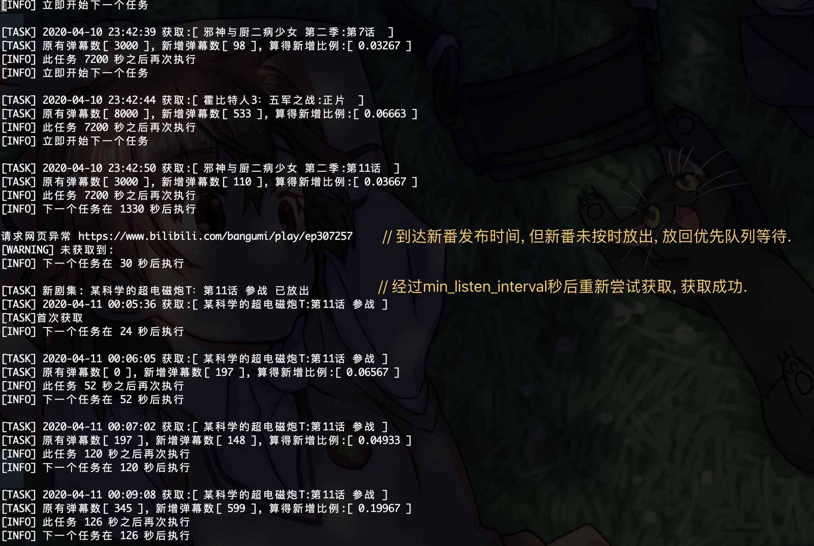

## B站弹幕下载脚本

此脚本用于下载和分析b站视频的弹幕.

开发背景: 目前多数浏览器插件的弹幕下载功能仅支持下载固定数量（取决于视频可装载的弹幕容量）的最新的弹幕.此外，少数支持历史弹幕下载的插件或多或少都存在 API老旧或代码效率底下等问题.

由于此类脚本的耗时瓶颈在于API请求时间间隔，BiliDanmuToolkit在保证尽可能全面地获取全弹幕的同时，通过优化内部逻辑使得发出的API请求尽可能少，查找并删除重复弹幕的效率尽可能高，从而缩短获取全弹幕所需的时间.

目前脚本还处于开发阶段, 完成进度在下面已列出.

## Requirements

运行所需环境如下

* Python==3.7
* requests
* BeautifulSoup4

## 开发进度

`√`表示已完成, `×`表示有计划做但未开始, `=`表示部分完成

#### 弹幕获取: `DanmuMaster.py`

* \[=\]历史弹幕
  * \[√\]进度保存: 由于网络错误等状况而提前结束时保存目前已获取的弹幕.
  * \[×\]进度读取: 读取现存的进度.
  * \[=\]终止获取的判定\[注1\]: 
    * \[×\]通过历史弹幕月份API获取当前时间之前是否存在“有弹幕的日期”.
    * \[√\]当前获取的弹幕文件中 弹幕数量小于上限且不为0, 可以判定其之前没有更多弹幕, 也就是可以结束获取.
    * \[√\]连续N天0弹幕则判断停止
  * \[√\]首尾相连式获取：判断当前普通弹幕池中最早的日期, 下一次获取直接从此日期开始而无需挨个天数获取.
* \[=\]最新弹幕
  * \[√\]循环获取弹幕当前最新弹幕池累计弹幕, 以突破历史弹幕的弹幕池上限\[注2\].
    * \[√\]预约番剧更新时间, 到时间自动开始检测并获取最新剧集的弹幕.
    * \[√\]通过增量判断下次获取的时间间隔, 减少请求次数.
    * \[√\]可同时获取多个番剧.
  * \[×\]通过多线程实现用户实时管理队列.
* \[×\]直播弹幕 (未考虑)

#### 多任务控制: `BangumiController.py`
* \[√\]使用配置文件实现复杂设置
  * \[√\]配置文件中批量添加番剧id.
  * \[√\]针对每个番剧设置不同的优先级, 当任务拥挤时优先获取高优先级番剧的数据.
  * \[√\]支持手动设置新电影/番剧的更新时间.
* \[√\]单线程
  * \[√\]根据番剧列表自动添加实时最新剧集到任务队列中.
  * \[√\]在任务队列中包含"刷新新番时间表"等功能自动添加最新剧集到任务队列中.
* \[×\]多线程
  * \[×\]用户可在控制台实时控制任务队列的增加和删除.
  * \[×\]实时监测配置文件.
* \[x\]支持监听up主发布的新视频.

#### 发送API请求: `DanmuSpider.py`

* \[√\]请求当前弹幕, 无需cookie.
* \[√\]请求历史弹幕, 需要cookie.
* \[√\]请求历史月份弹幕信息, 需要cookie.
* \[√\]请求网页, 无需cookie.
* \[√\]请求新番时间表.

#### 弹幕分析类: `DanmuFileTools.py`

* \[=\]读取弹幕
  * \[√\]各弹幕池以及各类型弹幕的数量
  * \[×\]词频
  * \[×\]弹幕发射时间分布
  * \[×\]弹幕在视频中的分布
* \[=\]弹幕写入
  * \[√\]在指定的harvest目录写入
  * \[×\]自定义目录写入
  * \[×\]调整字体: 字号, 颜色.
  * \[×\]增加, 删除 弹幕
* \[=\]多文件操作
  * \[√\]多文件比较
  * \[×\]弹幕文件合并
  * \[×\]弹幕文件拆分

#### 注1
正常情况下判断历史弹幕结束获取的方式是看获取到的最早的弹幕是否和视频发布日期匹配,
但是由于以下情况,导致无法通过上述方式结束获取:

* 视频的弹幕极少,可能隔很久才有一个弹幕, 造成获取失败数目较多(需要尝试每一天的历史弹幕)
* 番剧和电影无法获取视频的真实发布时间.
* b站限制获取历史弹幕的日期 (API返回报错)
* b站弹幕数据库抽风 (API返回无弹幕, 但通过弹幕历史月份API可以查到弹幕的存在)
* up主将连续N天的弹幕全部删除 (常见于较火的视频, 以及有弹幕施工的视频)

#### 注2
由于b站每次请求历史弹幕只返回有限数量的弹幕，因此如果历史某一天的弹幕数量大于这个弹幕池的数量，
则当天早些时候发的弹幕就无法获取到，因此最后获取的总弹幕数量会小于网站标称的数量.

为了解决这个问题, 只能在从现在开始的每一天循环不断地获取当前最新弹幕, 
每日的弹幕总获取量才能突破弹幕池数量的限制.
而历史弹幕无法挽救.

## 使用方法
目前加入命令行参数的功能有限, 可通过`--help`查询.
```shell script
git clone https://github.com/Od1gree/BiliDanmuToolkit
cd BiliDanmuToolkit/
# 查看帮助文件
python3 main.py --help
# 获取一个视频的历史弹幕
python3 main.py --history --cookie 'cookie_sample.cfg' --video-num av314 --index 1
# 监听新番弹幕
python3 main.py --listen --bangumi 'bangumi_sample.cfg'
```

注1: B站cookie直接从浏览器中查找cookie内容,并粘贴到`cookie.cfg`即可, 粘贴时不要带"Cookie:".

注2: 获取到的弹幕样例在harvest文件夹.

注3: 命令行中的参数为url或者文件名时,需要加单引号.

## 运行截图
下面列出测试时的截图.
### 1.获取普通视频历史弹幕的截图
> 测试视频: av170001 p3

开始运行的截图:


结束获取时的截图:


### 2.获取番剧历史弹幕的截图
> 测试视频: 轻音少女第一季第十集 ep21274
>
> 此番剧在b站上架时间约为2019年5月.

截图如下:


### 3.监听番剧弹幕
>测试时包含新番(包含正在更新以及还未发布), 旧番, 电影 (电影目前仅支持手动预约)
>
>下图测试所使用的 bangumi.cfg 即为 bangumi_sample.cfg 中的内容
>
>配置文件的写法在 bangumi_sample.cfg 中有说明.

开始运行的截图:


到新剧集发布时的截图:


## 注意事项
B站对API接口的限制以及弹幕数据库的限制会影响获取的效果, 有时会因官方服务器波动而获取不全面, 需要等待几天后再尝试.

* av810872 标称121万，实际获取90万.
* av43526 标称19万，实际获取16万.

